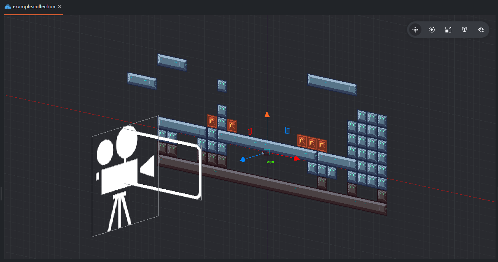

# 3d-tilemap example

Converting 2D tilemap:



Into 3D mesh:


#Usage:

1. Copy ‘mtool.lua’ module to your project.
2. Create a standard tilemap.
3. Add to scene a game object with a mesh component. Setup it the same texture as tilemap is using. We will use this mesh as target later.
4. In your code require mtool: local mtool = require "src.mtool"
5. Configure the options table. (see example.script)
6. Create a mesh from tilemap:
``` 
    self.grid = mtool.create_mesh_from_tilemap(meshurl, options)
```
7. Hide origin tilemap.
```
    msg.post(options.tilemap, "disable")
```

Mtool also contains utility methods for:
- coloring quads by tile coordinates.
- converting world to tilemap coordinates.

---