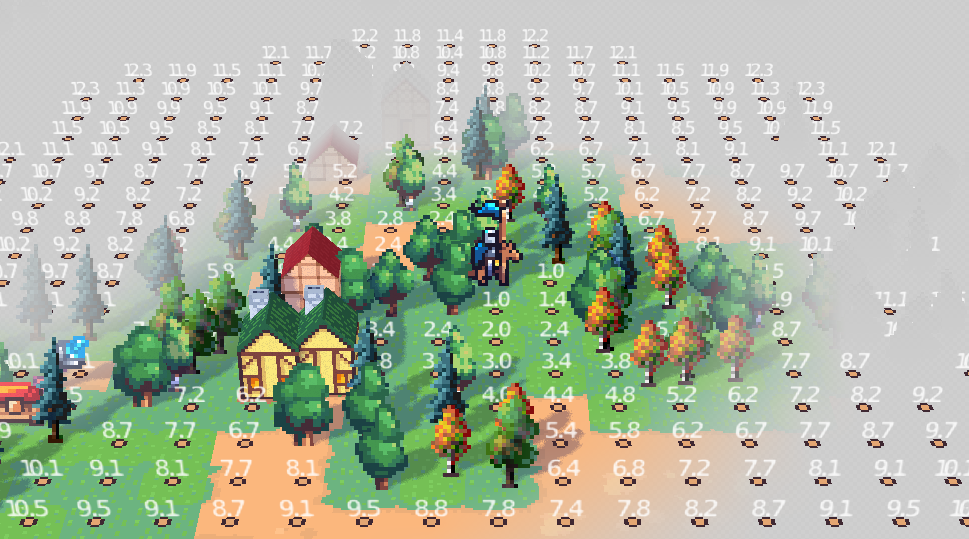

# A-Star

## Examples



#### function **a_star**(world, start, goal)

An A* pathfinding algorithm using heuristic techniques.

|   param  |    |
| --- | --- |
|   world  | a table where world[y][x] = cost (>0) or {0, nil/false} if a cell is blocked |
|   start  | a cell {x=.., y=..}   |
|   goal  |  a cell {x=.., y=..}   |
| **return** |
|   path  |  table path { {x=.., y=..}, ..}, or `nil` if path is not found.   |
|   cost  |  number Total cost of the path.    |

>[!NOTE]
> The size of the map depends on the dimension of the array **world**.


```
	local astar = require 'astar'

	local world = {
	{1,1,1,1},
	{1,100,nil,1},
	{1,1,1,1}
	}
	
	local path, cost = astar.a_star(world, {x=1, y=1}, {x=4, y=3})
	for i,p in ipairs(path or {}) do 
		print(p.x, p.y) 
	end
```

#### function **find_nearest_cells**(world, start, max_cost)

Search for all the nearest cells with cost > 0 and <= max_cost

|   param  |    |
| --- | --- |
|   world  | a table where world[y][x] = cost (>0) or {0, nil/false} if a cell is blocked |
|   start  | a cell {x=.., y=..}   |
|   max_cost  |  number   |
| **return** |
|   cells  |  table { {x=.., y=.., dist =..}, ..}   |
|   cost  |  number Total cost of the path.    |


```
	local astar = require 'astar'

	local world = {
	{1,1,1,1},
	{1,100,nil,1},
	{1,1,1,1}
	}
	
	local cells = astar.find_nearest_cells(world, {x=2, y=2}, 5)
	for i,c in ipairs(cells) do 
		print(c.x, c.y, c.dist) 
	end
```